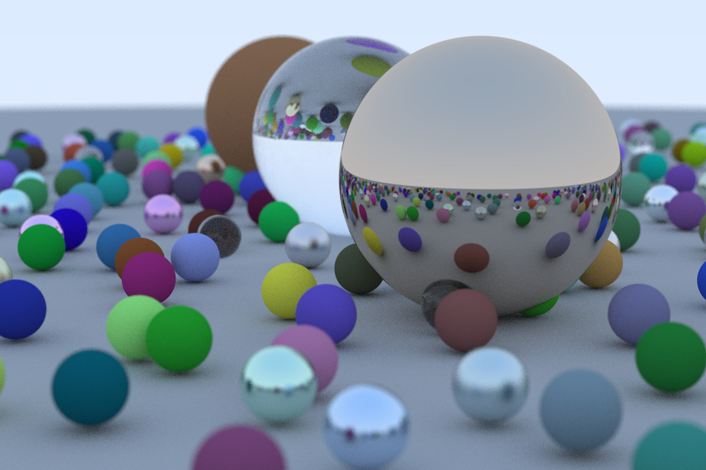

# Ray Tracing in One Weekend

This is the Rust implementation for the first book in the Ray Tracing in One Weekend series of books by Peter Shirley. The book is linked [here](https://raytracing.github.io/books/RayTracingInOneWeekend.html#metal/mirroredlightreflection). 
